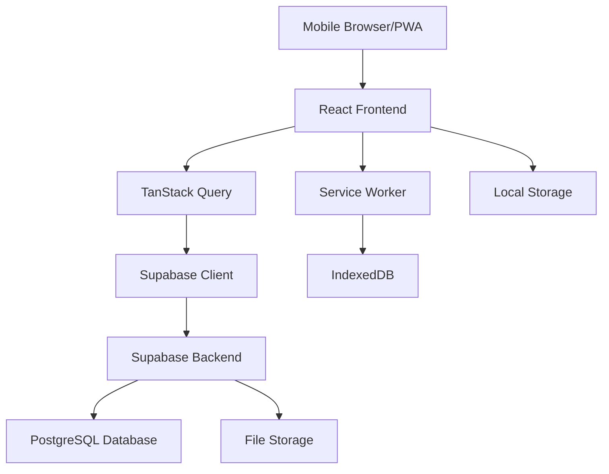

# Design Document

## Overview

The Seed Organizer app is a Progressive Web Application (PWA) built with React, TypeScript, and Supabase. The application provides farmers with an intuitive interface to manage suborganizers and track payments throughout farming seasons. The design emphasizes offline-first functionality, mobile responsiveness, and farmer-friendly UX with large touch targets and clear visual hierarchy.

## Architecture

### Technology Stack
- **Frontend**: React 18 + TypeScript + Vite
- **UI Framework**: shadcn/ui components with Radix UI primitives
- **Styling**: Tailwind CSS with custom farming theme
- **Backend**: Supabase (PostgreSQL database, Authentication, Storage)
- **State Management**: TanStack Query for server state, React Hook Form for forms
- **Offline Support**: Service Worker + IndexedDB for local storage
- **Charts**: Recharts for dashboard analytics
- **Mobile**: PWA with responsive design

### System Architecture



## Components and Interfaces

### Core Components

#### 1. Layout Components
- **AppLayout**: Main application shell with navigation
- **MobileNavigation**: Bottom tab navigation for mobile
- **Header**: Top header with title and actions
- **LoadingSpinner**: Consistent loading states

#### 2. Feature Components
- **SuborganizerCard**: Display suborganizer information
- **PaymentCard**: Display payment record with images
- **DashboardCard**: Summary statistics cards
- **FilterPanel**: Advanced filtering interface
- **ExportDialog**: Data export options

#### 3. Form Components
- **SuborganizerForm**: Add/edit suborganizer details
- **PaymentForm**: Record payment transactions
- **ImageUpload**: Handle bill/receipt uploads
- **DateRangePicker**: Filter by date ranges

#### 4. Chart Components
- **SpendingChart**: Visual spending analytics
- **CategoryChart**: Purpose-wise breakdown
- **PaymentModeChart**: Payment method distribution

### Page Structure

#### 1. Dashboard (`/`)
- Summary cards (total spending, active suborganizers)
- Quick action buttons
- Recent payments list
- Spending trends chart

#### 2. Suborganizers (`/suborganizers`)
- List view with search/filter
- Add new suborganizer FAB
- Individual suborganizer details

#### 3. Payments (`/payments`)
- Chronological payment list
- Filter by date, suborganizer, purpose
- Add payment FAB
- Payment details modal

#### 4. Reports (`/reports`)
- Interactive charts and analytics
- Export functionality
- Advanced filtering options

#### 5. Settings (`/settings`)
- App preferences
- Data backup/restore
- Offline sync status

## Data Models

### Database Schema

#### Suborganizers Table
```sql
CREATE TABLE suborganizers (
  id UUID PRIMARY KEY DEFAULT gen_random_uuid(),
  name VARCHAR(255) NOT NULL,
  phone VARCHAR(20) NOT NULL,
  village VARCHAR(255) NOT NULL,
  crop_type VARCHAR(100) NOT NULL,
  created_at TIMESTAMP WITH TIME ZONE DEFAULT NOW(),
  updated_at TIMESTAMP WITH TIME ZONE DEFAULT NOW(),
  user_id UUID REFERENCES auth.users(id) ON DELETE CASCADE
);
```

#### Payments Table
```sql
CREATE TABLE payments (
  id UUID PRIMARY KEY DEFAULT gen_random_uuid(),
  suborganizer_id UUID REFERENCES suborganizers(id) ON DELETE CASCADE,
  date DATE NOT NULL,
  amount DECIMAL(10,2) NOT NULL,
  purpose VARCHAR(100) NOT NULL CHECK (purpose IN (
    'Pesticides', 'Sowing Advance', 'Labor Cost', 'Rouging', 
    'Detaching', 'Seed Lifting', 'Gunny Bags', 'Transportation'
  )),
  payment_mode VARCHAR(50) NOT NULL CHECK (payment_mode IN (
    'Cash', 'Cheque', 'PhonePe', 'Google Pay', 'Bank Transfer', 'Other'
  )),
  bill_receipt_url VARCHAR(500),
  payment_screenshot_url VARCHAR(500),
  notes TEXT,
  created_at TIMESTAMP WITH TIME ZONE DEFAULT NOW(),
  updated_at TIMESTAMP WITH TIME ZONE DEFAULT NOW(),
  user_id UUID REFERENCES auth.users(id) ON DELETE CASCADE
);
```

#### Seasons Table (for future enhancements)
```sql
CREATE TABLE seasons (
  id UUID PRIMARY KEY DEFAULT gen_random_uuid(),
  name VARCHAR(100) NOT NULL,
  start_date DATE NOT NULL,
  end_date DATE NOT NULL,
  is_active BOOLEAN DEFAULT FALSE,
  user_id UUID REFERENCES auth.users(id) ON DELETE CASCADE
);
```

### TypeScript Interfaces

```typescript
interface Suborganizer {
  id: string;
  name: string;
  phone: string;
  village: string;
  cropType: string;
  createdAt: string;
  updatedAt: string;
  userId: string;
}

interface Payment {
  id: string;
  suborganizerId: string;
  date: string;
  amount: number;
  purpose: PaymentPurpose;
  paymentMode: PaymentMode;
  billReceiptUrl?: string;
  paymentScreenshotUrl?: string;
  notes?: string;
  createdAt: string;
  updatedAt: string;
  userId: string;
  suborganizer?: Suborganizer;
}

type PaymentPurpose = 
  | 'Pesticides' 
  | 'Sowing Advance' 
  | 'Labor Cost' 
  | 'Rouging' 
  | 'Detaching' 
  | 'Seed Lifting' 
  | 'Gunny Bags' 
  | 'Transportation';

type PaymentMode = 
  | 'Cash' 
  | 'Cheque' 
  | 'PhonePe' 
  | 'Google Pay' 
  | 'Bank Transfer' 
  | 'Other';
```

## Error Handling

### Client-Side Error Handling
- **Form Validation**: Zod schemas for type-safe validation
- **Network Errors**: Retry logic with exponential backoff
- **Offline Handling**: Queue operations for sync when online
- **Image Upload Errors**: Compression and retry mechanisms
- **User Feedback**: Toast notifications for all error states

### Server-Side Error Handling
- **Database Constraints**: Foreign key and check constraints
- **File Upload Limits**: Size and type restrictions
- **Authentication**: Row Level Security (RLS) policies
- **Rate Limiting**: Supabase built-in protections

### Error Recovery Strategies
```typescript
// Example error boundary for payment operations
const PaymentErrorBoundary = ({ children }) => {
  return (
    <ErrorBoundary
      fallback={<PaymentErrorFallback />}
      onError={(error) => {
        // Log to monitoring service
        console.error('Payment operation failed:', error);
        // Queue for retry if network error
        if (isNetworkError(error)) {
          queueForRetry(error.operation);
        }
      }}
    >
      {children}
    </ErrorBoundary>
  );
};
```

## Testing Strategy

### Unit Testing
- **Components**: React Testing Library for UI components
- **Utilities**: Jest for business logic and data transformations
- **Hooks**: Custom hooks testing with renderHook
- **Forms**: Form validation and submission flows

### Integration Testing
- **API Integration**: Mock Supabase client for consistent testing
- **Offline Scenarios**: Service worker and IndexedDB interactions
- **Image Upload**: File handling and compression testing
- **Data Sync**: Online/offline state transitions

### End-to-End Testing
- **User Workflows**: Complete payment recording flow
- **Cross-Device**: PWA installation and usage
- **Offline Functionality**: Full offline-to-online sync testing
- **Export Features**: PDF/Excel generation validation

### Performance Testing
- **Bundle Size**: Analyze and optimize chunk sizes
- **Image Loading**: Lazy loading and compression effectiveness
- **Database Queries**: Query performance with large datasets
- **Mobile Performance**: Touch responsiveness and scroll performance

## Offline Support Implementation

### Service Worker Strategy
```typescript
// Cache-first strategy for static assets
// Network-first strategy for API calls with fallback to cache
// Background sync for payment submissions

const CACHE_NAME = 'seed-organizer-v1';
const API_CACHE = 'api-cache-v1';

self.addEventListener('fetch', (event) => {
  if (event.request.url.includes('/api/')) {
    event.respondWith(networkFirstStrategy(event.request));
  } else {
    event.respondWith(cacheFirstStrategy(event.request));
  }
});
```

### Local Data Management
- **IndexedDB**: Store payments and suborganizers for offline access
- **Sync Queue**: Track pending operations for background sync
- **Conflict Resolution**: Last-write-wins with user notification
- **Image Caching**: Store compressed images locally

## Security Considerations

### Authentication & Authorization
- **Supabase Auth**: Email/password authentication
- **Row Level Security**: User-specific data isolation
- **Session Management**: Secure token handling
- **Password Requirements**: Strong password enforcement

### Data Protection
- **Input Sanitization**: Prevent XSS and injection attacks
- **File Upload Security**: Type and size validation
- **HTTPS Only**: Enforce secure connections
- **Data Encryption**: At-rest encryption via Supabase

### Privacy
- **Data Minimization**: Collect only necessary information
- **Local Storage**: Encrypt sensitive offline data
- **Image Metadata**: Strip EXIF data from uploads
- **Audit Logging**: Track data access and modifications

## Mobile-First Design Principles

### Touch Interface
- **Minimum Touch Target**: 44px minimum for all interactive elements
- **Gesture Support**: Swipe actions for common operations
- **Haptic Feedback**: Vibration for important actions
- **Thumb-Friendly**: Navigation within thumb reach zones

### Performance Optimization
- **Code Splitting**: Route-based lazy loading
- **Image Optimization**: WebP format with fallbacks
- **Bundle Analysis**: Regular bundle size monitoring
- **Critical CSS**: Inline critical styles for faster rendering

### Responsive Design
- **Mobile-First**: Design for smallest screens first
- **Flexible Layouts**: CSS Grid and Flexbox
- **Adaptive Images**: Responsive image sizing
- **Typography Scale**: Readable text at all screen sizes

## Theme and Visual Design

### Color Palette
```css
:root {
  /* Primary - Earth Green */
  --primary: 120 60% 35%;
  --primary-foreground: 0 0% 98%;
  
  /* Secondary - Harvest Gold */
  --secondary: 45 85% 55%;
  --secondary-foreground: 0 0% 15%;
  
  /* Accent - Sky Blue */
  --accent: 200 70% 50%;
  --accent-foreground: 0 0% 98%;
  
  /* Success - Growth Green */
  --success: 140 70% 45%;
  
  /* Warning - Caution Orange */
  --warning: 35 85% 55%;
  
  /* Error - Alert Red */
  --destructive: 0 70% 50%;
}
```

### Typography
- **Primary Font**: Inter (system fallback)
- **Headings**: Bold weights for hierarchy
- **Body Text**: Regular weight, high contrast
- **Numbers**: Tabular figures for financial data

### Iconography
- **Lucide React**: Consistent icon system
- **Custom Icons**: Farming-specific illustrations
- **Touch Targets**: Icons sized for easy tapping
- **Semantic Colors**: Status-based color coding